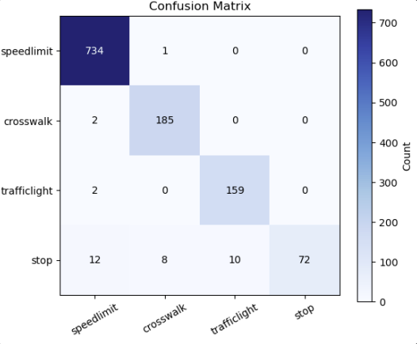
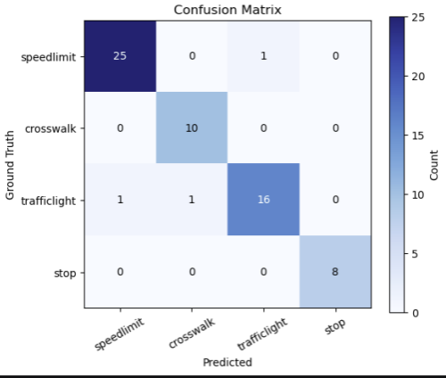
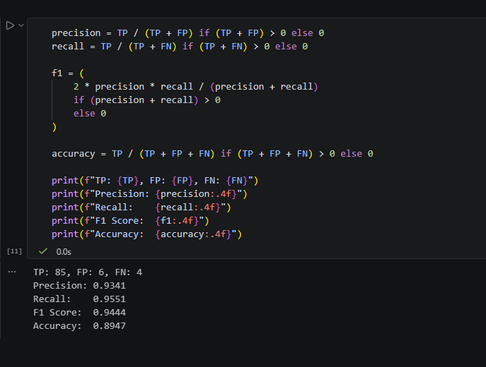
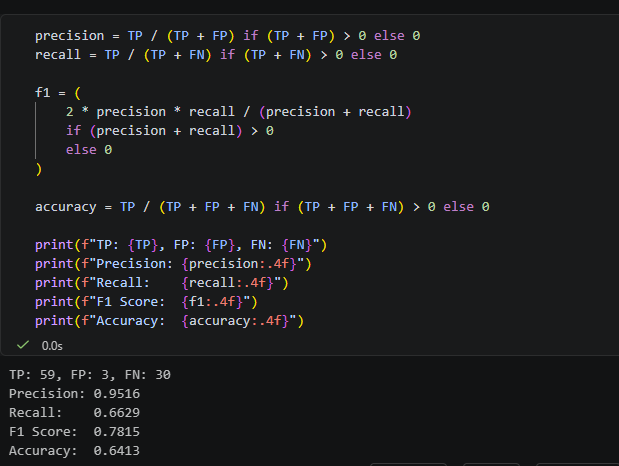
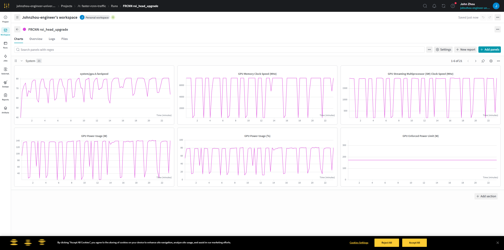

# Cross-Dataset Road Sign Detection for ADAS:A YOLOv8 and Faster R-CNN Evaluation Pipeline with Out-of-Distribution Generalization Assessment

## 📌 Overview
This project implements a **cross-dataset object detection pipeline** for road sign detection in ADAS systems.

The goal is to improve **out-of-distribution (OOD) generalization** by combining:
- YOLOv8 (high recall)
- Faster R-CNN (high precision)

The system uses:
- DatasetNinja → training dataset
- Mapillary → OOD evaluation dataset

---

## 🚀 Pipeline Summary

1. Train YOLOv8 on DatasetNinja  
2. Use YOLO to run inference on Mapillary images  
3. Filter valid detections (pseudo-labels)  
4. Manually select high-quality samples → OOD test set  
5. Train Faster R-CNN on DatasetNinja  
6. Evaluate Faster R-CNN on OOD dataset  

---

## 📂 Project Structure
├── data.yaml # YOLO dataset config
├── yolo_training.py # Train YOLOv8
├── ninja_dataset_to_yolo_conversion.py
├── yolo_train_val_test_split.py

├── infer.py # YOLO inference on Mapillary
├── filter_valid_image.py # Keep images with detections
├── file_name_change.py # Rename images
├── visualization.py # Visualize bounding boxes

├── hand_picked_test_dataset.py # Extract selected OOD samples

├── frcnn_train_on_ninja_dataset.py # Train Faster R-CNN
├── frcnn_test_on_ninja_dataset.ipynb
├── frcnn_test_on_hand_picked_dataset.ipynb


---

## 🧠 Methodology

## Model Training

### YOLO Training
- Model: YOLOv8s
- Dataset: DatasetNinja
- Epochs: 50
- Output: trained YOLO model
- File_name: YOLO/yolo_training.py

```python
# ====  Load Model ====
    model = YOLO("yolov8s.pt")

    # ====  Train ====
    model.train(
        data="data.yaml",
        epochs=50,
        imgsz=640,
        batch=32,
        device=0,
        project="runs",
        name="detect_exp",
        exist_ok=True,

        # performance tweaks
        cache=True,
        workers=4,
        verbose=True
    )
```

### Faster R-CNN Training

- Model: Backbone: ResNet50-FPN (pretrained) + Custom ROI head (2 FC layers + dropout)
- Dataset: DatasetNinja
- Epochs: 15
- Output: trained frcnn model
- File_name: FRCNN/frcnn_train_on_ninja_dataset.py

Two-phase training:
- Phase 1
Freeze backbone
Train ROI head

- Phase 2
Partially unfreeze backbone
Fine-tune

```python
# ==== Model ====
def get_model(num_classes=5, freeze_backbone=False, freeze_layers=False):
    model = torchvision.models.detection.fasterrcnn_resnet50_fpn(
        weights="DEFAULT"
    )

    in_features = model.roi_heads.box_predictor.cls_score.in_features


    model.roi_heads.box_predictor = CustomROIHead(in_features, num_classes)

    if freeze_backbone:
        for param in model.backbone.parameters():
            param.requires_grad = False

    elif freeze_layers:
        for name, param in model.backbone.body.named_parameters():
            if "layer1" in name or "layer2" in name:
                param.requires_grad = False

    return model

# ==== Training ====
def train_model(train_loader, val_loader, epochs=15):

    device = torch.device("cuda" if torch.cuda.is_available() else "cpu")

    PHASE1_EPOCHS = 10
    best_val_loss = float("inf")

    wandb.init(project="faster-rcnn-traffic", name="roi_head_upgrade+smaller data set", mode="offline")

    scaler = torch.cuda.amp.GradScaler()

    # Phase 1
    model = get_model(NUM_CLASSES, freeze_backbone=True)
    model.to(device)

    optimizer = torch.optim.AdamW(
        filter(lambda p: p.requires_grad, model.parameters()),
        lr=3e-4
    )

    for epoch in range(PHASE1_EPOCHS):
        model.train()
        train_loss = 0

        for images, targets in train_loader:
            images = [img.to(device) for img in images]
            targets = [{k: v.to(device) for k, v in t.items()} for t in targets]

            with torch.cuda.amp.autocast():
                loss_dict = model(images, targets)
                loss = sum(loss_dict.values())

            optimizer.zero_grad()
            scaler.scale(loss).backward()
            scaler.step(optimizer)
            scaler.update()

            train_loss += loss.item()

        train_loss /= len(train_loader)
        val_loss = evaluate(model, val_loader, device)

        print(f"[Phase1][Epoch {epoch}] Train={train_loss:.4f}, Val={val_loss:.4f}")

        if val_loss < best_val_loss:
            best_val_loss = val_loss
            torch.save(model.state_dict(), "best_model_roi_smaller.pth")

    # Phase 2
    model = get_model(NUM_CLASSES, freeze_layers=True)
    model.load_state_dict(torch.load("best_model_roi_smaller.pth"))
    model.to(device)

    optimizer = torch.optim.AdamW([
        {"params": model.backbone.parameters(), "lr": 1e-5},
        {"params": model.roi_heads.parameters(), "lr": 1e-4},
    ])

    for epoch in range(PHASE1_EPOCHS, epochs):
        model.train()
        train_loss = 0

        for images, targets in train_loader:
            images = [img.to(device) for img in images]
            targets = [{k: v.to(device) for k, v in t.items()} for t in targets]

            with torch.cuda.amp.autocast():
                loss_dict = model(images, targets)
                loss = sum(loss_dict.values())

            optimizer.zero_grad()
            scaler.scale(loss).backward()
            scaler.step(optimizer)
            scaler.update()

            train_loss += loss.item()

        train_loss /= len(train_loader)
        val_loss = evaluate(model, val_loader, device)

        print(f"[Phase2][Epoch {epoch}] Train={train_loss:.4f}, Val={val_loss:.4f}")

        if val_loss < best_val_loss:
            best_val_loss = val_loss
            torch.save(model.state_dict(), "best_model_smaller.pth")

    wandb.finish()
    return model
```


## Purpose of trained YOLO model

In this project, YOLO is not the final model being evaluated — it is mainly used as a tool to assist the pipeline.
The main purpose for yolo is for candidate detection for pseudo labeling for FRCNN model.
YOLO is used to scan Mapillary images and find where road signs exist.  
YOLO runs inference on Mapillary (unseen dataset)
It identifies images that likely contain: speed limits, stop signs, traffic lights and crosswalks
This helps avoid manually searching thousands of images

*Figure 1: Representative YOLO predictions on Mapillary images used for OOD test set candidate selection*


## Model Testing

Model testing in this project is carried out under both in-distribution and out-of-distribution (OOD) conditions to evaluate detection performance and generalization capability. As described in the study , both YOLOv8 and Faster R-CNN are first tested on a held-out portion of the DatasetNinja dataset, which represents the same distribution as the training data.

To assess real-world robustness, an OOD testing phase is introduced using a curated subset of images from the Mapillary dataset. YOLO is first applied in inference mode to identify candidate images containing relevant road signs. These detections are filtered and manually verified to form a high-quality test set. Neither YOLO nor Faster R-CNN is trained on this dataset, ensuring a true evaluation of generalization.

Results show that both models experience a drop in performance under OOD conditions, highlighting the effect of distribution shift. Faster R-CNN achieves higher precision, while YOLO maintains higher recall. This demonstrates the trade-off between the two architectures and emphasizes the importance of cross-dataset testing in safety-critical applications such as ADAS.

1. IN-DISTRIBUTION TESTING (DatasetNinja)
Testing the model on data similar to what it was trained on
Dataset: DatasetNinja

*Figure 2: FRCNN Model Confusion Matrix on Ninja Dataset*



3. OUT-OF-DISTRIBUTION (OOD) TESTING (Mapillary)
Testing on completely different data the model has NEVER seen

Dataset: Mapillary Traffic Sign Dataset
Images: 100 manually selected samples

*Figure 3: FRCNN Model Confusion Matrix on Mapillary Dataset*



## Evaluation Metrics
The performance of the Faster R-CNN model was evaluated using precision, recall, F1-score, and accuracy, derived from true positives (TP), false positives (FP), and false negatives (FN). These metrics provide a comprehensive understanding of detection quality, particularly in safety-critical applications like ADAS.

On the in-distribution dataset, the model achieved very high precision (~0.93) and recall (~0.95), resulting in an F1-score of approximately 0.94 and accuracy of ~0.89. This indicates that the model is highly effective at correctly detecting road signs while minimizing both false positives and false negatives when tested on familiar data.

*Figure 4: FRCNN Test Evaluation of Ninja Dataset*


However, when evaluated on unseen or out-of-distribution (OOD) datasets, performance declined. Precision remained relatively high (above 0.95), showing that most detected objects were correct. In contrast, recall dropped more significantly (as low as ~0.66 in some cases), indicating that the model failed to detect a notable number of true objects. This led to a lower F1-score (~0.78) and reduced accuracy (~0.64), highlighting the model’s sensitivity to distribution shift.

*Figure 5: FRCNN Test Evaluation of Mapillary OOD Dataset*


Overall, these metrics demonstrate that while Faster R-CNN maintains strong precision across datasets, its recall is more affected by unseen data. This suggests that the model is conservative in its predictions under OOD conditions, favoring fewer but more accurate detections. Such behavior is desirable in some contexts but may require improvement in recall for applications where missing objects is critical.

*Figure 6: FRCNN Compute Utilization*



